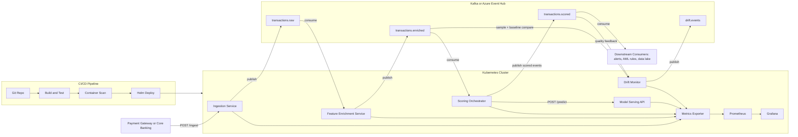

# Real-Time Transaction Scoring Pipeline (RT-Score)

Event-driven, low-latency fraud/AML scoring platform that enriches transactions, applies ML inference in real time, and publishes scored outcomes for downstream decisioning.

## Goals and Non-Goals

### Goals
- Deliver end-to-end scoring from raw ingestion to scored output with p95 prediction latency under 150 ms.
- Provide production-grade observability, drift monitoring, and operational runbooks for fast incident response.
- Enable repeatable deployments through Kubernetes and CI/CD with versioned models and schema contracts.

### Non-Goals
- Building a full-featured case-management UI for investigators.
- Implementing advanced online learning inside the serving path.
- Replacing enterprise IAM, SIEM, or data warehouse platforms.

## High-Level Architecture



## Component Descriptions

### Ingestion Service
**Purpose:** Receives raw transaction requests and writes validated events to the raw stream.

**Tech choices:** Python 3.12, FastAPI, pydantic, confluent-kafka, uvicorn.

**Key responsibilities**
- Validate request payloads and enforce schema version.
- Attach correlation metadata (trace id, tenant id, event time).
- Publish canonical transaction events to `transactions.raw`.

**API endpoints or message topics**
- `POST /ingest`
- Topic: `transactions.raw`

Example request payload:
```json
{
	"transaction_id": "txn_101",
	"account_id": "acc_77",
	"amount": 245.19,
	"currency": "USD",
	"merchant_id": "m_991",
	"event_time": "2026-06-08T11:09:10Z"
}
```

**Scaling and HA strategy**
- Stateless deployment with horizontal scaling (HPA on CPU and request rate).
- Multi-replica pods behind ClusterIP service.
- Retry with exponential backoff on broker publish failures.

**Observability points**
- Metrics: `ingestion_requests_total`, `ingestion_publish_failures_total`, `ingestion_latency_ms`.
- Logs: structured validation and publish outcome logs.
- Traces: span for request parsing and broker publish.

### Feature Enrichment Service
**Purpose:** Enriches raw transactions with derived and lookup-based features required for scoring.

**Tech choices:** Python 3.12, Faust/aiokafka consumer, Redis feature cache, pydantic.

**Key responsibilities**
- Consume from `transactions.raw`.
- Derive features (velocity, geo distance, historical ratios).
- Publish enriched events to `transactions.enriched`.

**API endpoints or message topics**
- Input topic: `transactions.raw`
- Output topic: `transactions.enriched`

Example enriched topic payload:
```json
{
	"transaction_id": "txn_101",
	"amount": 245.19,
	"features": {
		"txn_count_1h": 7,
		"avg_amount_7d": 132.42,
		"geo_distance_km": 842.6
	}
}
```

**Scaling and HA strategy**
- Scale by partition count and consumer group rebalancing.
- At-least-once processing with idempotent produce semantics.
- Redis cluster mode for cache durability.

**Observability points**
- Metrics: `enrichment_consume_lag`, `enrichment_duration_ms`, `enrichment_failures_total`.
- Logs: feature source, fallback reason, schema version.
- Traces: consumer poll, feature lookup, produce.

### Model Serving API
**Purpose:** Serves fraud risk predictions for enriched transactions using versioned ML models.

**Tech choices:** Python 3.12, FastAPI, ONNX Runtime or XGBoost runtime, pydantic, gunicorn.

**Key responsibilities**
- Validate inference payload against model input contract.
- Return score, confidence, and active model version.
- Expose health endpoints for orchestration and autoscaling.

**API endpoints or message topics**
- `POST /predict`
- `GET /healthz`
- `GET /readyz`

Example response payload:
```json
{
	"transaction_id": "txn_101",
	"score": 0.93,
	"confidence": 0.89,
	"model_version": "fraud-xgb-2026.06.1",
	"scored_at": "2026-06-08T11:09:10.120Z"
}
```

**Scaling and HA strategy**
- HPA based on CPU and `http_server_requests_seconds_bucket` p95.
- PodDisruptionBudget and anti-affinity across nodes.
- Optional canary deployment for new model versions.

**Observability points**
- Metrics: `model_predict_latency_ms`, `model_inference_errors_total`, `model_confidence_avg`.
- Logs: model version, prediction path, payload hash.
- Traces: request validation, feature vector build, inference call.

### Scoring Orchestrator
**Purpose:** Coordinates enriched event consumption, model inference calls, and scored event publication.

**Tech choices:** Python 3.12, aiokafka, httpx, tenacity retry, OpenTelemetry SDK.

**Key responsibilities**
- Consume `transactions.enriched` with consumer group `scoring-orchestrator-v1`.
- Call Model Serving API `/predict` and merge response into scored event.
- Publish to `transactions.scored` with idempotency key.

**API endpoints or message topics**
- Input topic: `transactions.enriched`
- Output topic: `transactions.scored`

Example scored payload:
```json
{
	"transaction_id": "txn_101",
	"score": 0.93,
	"confidence": 0.89,
	"model_version": "fraud-xgb-2026.06.1",
	"timestamp": "2026-06-08T11:09:10.121Z"
}
```

**Scaling and HA strategy**
- Partition-aware scaling; replicas <= topic partitions.
- Circuit breaker for model endpoint failures.
- Dead-letter topic `transactions.scoring.dlq` for poison events.

**Observability points**
- Metrics: `orchestrator_end_to_end_latency_ms`, `orchestrator_retry_total`, `queue_lag`.
- Logs: retry attempts, DLQ routing, scoring status.
- Traces: consume -> predict -> publish end-to-end span.

### Drift Monitor
**Purpose:** Detects feature and prediction distribution changes and raises retraining alerts.

**Tech choices:** Python 3.12, scipy, pandas, prometheus_client, cronjob or deployment mode.

**Key responsibilities**
- Compare recent windows vs baseline for selected features.
- Compute PSI/KS drift indicators and export metrics.
- Emit drift events to `drift.events` and alert channels.

**API endpoints or message topics**
- Input topics: `transactions.enriched`, `transactions.scored`
- Output topic: `drift.events`

**Scaling and HA strategy**
- Stateful processing partitioned by feature set or segment.
- Scheduled checkpointing to object storage.
- Active-passive mode for single-writer alert publishing.

**Observability points**
- Metrics: `drift_psi_<feature>`, `drift_alerts_total`, `drift_window_samples`.
- Logs: baseline ID, statistical test output.
- Traces: sampling and metric push.

### Metrics Exporter
**Purpose:** Standardizes and exposes service and business metrics to Prometheus.

**Tech choices:** OpenTelemetry Collector, prometheus_client, custom exporter hooks.

**Key responsibilities**
- Scrape/aggregate app metrics from all services.
- Normalize labels (`service`, `env`, `model_version`).
- Expose `/metrics` endpoints and relay traces.

**API endpoints or message topics**
- `GET /metrics`

**Scaling and HA strategy**
- Agent per node or sidecar pattern.
- HA collector pair with load-balanced remote write.

**Observability points**
- Metrics: `scrape_duration_seconds`, `exporter_errors_total`.
- Logs: scrape status, label cardinality warnings.
- Traces: telemetry pipeline stages.

### Grafana Dashboards
**Purpose:** Visualizes platform health, model quality, and operational risk signals.

**Tech choices:** Grafana OSS, provisioned dashboards via JSON, Prometheus datasource.

**Key responsibilities**
- Provide SLO views for latency, throughput, and error rates.
- Display drift and confidence trends.
- Highlight top anomalous transactions and queue lag.

**API endpoints or message topics**
- Dashboard IDs: `rt-score-overview`, `rt-score-drift`, `rt-score-ops`.

**Scaling and HA strategy**
- Stateless replicas with shared persistent store.
- Provision dashboards via config map and GitOps.

**Observability points**
- Metrics: `grafana_http_request_duration_seconds`, `grafana_alerting_active_alerts`.
- Logs: dashboard provision, datasource errors.

### Kubernetes Infrastructure
**Purpose:** Runs all services with resilient scheduling, networking, autoscaling, and service discovery.

**Tech choices:** Kubernetes 1.30+, Helm 3, NGINX Ingress, cert-manager.

**Key responsibilities**
- Deploy and scale stateless and stateful workloads.
- Enforce network policies and TLS certificates.
- Integrate monitoring via ServiceMonitor objects.

**API endpoints or message topics**
- Internal services: `ingestion-svc`, `enrichment-svc`, `model-svc`, `orchestrator-svc`.

**Scaling and HA strategy**
- Multi-AZ node pools.
- Pod anti-affinity and disruption budgets.
- StatefulSets for IRIS-like stateful backends when needed.

**Observability points**
- Metrics: node utilization, pod restarts, HPA saturation.
- Logs: kube events, deployment rollouts.
- Traces: ingress to service call chain.

### CI/CD Pipeline
**Purpose:** Automates build, validation, security checks, and progressive deployment.

**Tech choices:** GitHub Actions (or Azure DevOps), Trivy, Helm, kubectl.

**Key responsibilities**
- Build and test each service image.
- Scan containers and enforce policy gates.
- Deploy Helm releases and run smoke tests.

**API endpoints or message topics**
- Pipeline stages: `build`, `test`, `scan`, `deploy`, `smoke`.

**Scaling and HA strategy**
- Parallel jobs by service directory.
- Environment promotion (`dev -> stage -> prod`).

**Observability points**
- Metrics: deployment frequency, failure rate, lead time.
- Logs: pipeline artifact versions and rollout status.

### Local Development Environment
**Purpose:** Enables reproducible local testing of full event flow before cluster deployment.

**Tech choices:** Docker Compose, kind/minikube, local Kafka/Redpanda, Makefile.

**Key responsibilities**
- Boot all core services and topics locally.
- Run seed data and smoke scoring scripts.
- Validate schema contracts and basic dashboards.

**API endpoints or message topics**
- Local endpoints: `http://localhost:8080/ingest`, `http://localhost:8090/predict`.
- Local topics: same names as production for parity.

**Scaling and HA strategy**
- Single-node defaults with optional multi-replica simulation.

**Observability points**
- Metrics and logs available through local Prometheus/Grafana stack.

## Data Model and Schemas

### Canonical `transaction` Schema

```json
{
	"$id": "rt-score.transaction.v1",
	"type": "object",
	"required": [
		"transaction_id",
		"account_id",
		"amount",
		"currency",
		"merchant_id",
		"event_time"
	],
	"properties": {
		"transaction_id": {"type": "string"},
		"account_id": {"type": "string"},
		"amount": {"type": "number"},
		"currency": {"type": "string", "minLength": 3, "maxLength": 3},
		"merchant_id": {"type": "string"},
		"channel": {"type": "string", "enum": ["card_present", "card_not_present", "wire", "ach"]},
		"country": {"type": "string"},
		"event_time": {"type": "string", "format": "date-time"}
	}
}
```

Example `transaction` event:
```json
{
	"transaction_id": "txn_101",
	"account_id": "acc_77",
	"amount": 245.19,
	"currency": "USD",
	"merchant_id": "m_991",
	"channel": "card_not_present",
	"country": "US",
	"event_time": "2026-06-08T11:09:10Z"
}
```

### `enriched_transaction` Schema

```json
{
	"$id": "rt-score.enriched-transaction.v1",
	"type": "object",
	"required": ["transaction", "features", "enriched_at"],
	"properties": {
		"transaction": {"$ref": "rt-score.transaction.v1"},
		"features": {
			"type": "object",
			"required": ["txn_count_1h", "avg_amount_7d", "geo_distance_km"],
			"properties": {
				"txn_count_1h": {"type": "integer"},
				"avg_amount_7d": {"type": "number"},
				"geo_distance_km": {"type": "number"},
				"merchant_risk_score": {"type": "number"},
				"is_new_device": {"type": "boolean"}
			}
		},
		"enriched_at": {"type": "string", "format": "date-time"}
	}
}
```

### `scored_transaction` Schema

```json
{
	"$id": "rt-score.scored-transaction.v1",
	"type": "object",
	"required": [
		"transaction_id",
		"score",
		"model_version",
		"confidence",
		"timestamp"
	],
	"properties": {
		"transaction_id": {"type": "string"},
		"score": {"type": "number", "minimum": 0, "maximum": 1},
		"model_version": {"type": "string"},
		"confidence": {"type": "number", "minimum": 0, "maximum": 1},
		"timestamp": {"type": "string", "format": "date-time"},
		"decision": {"type": "string", "enum": ["allow", "review", "block"]}
	}
}
```

## Messaging Topology

- Topics: `transactions.raw`, `transactions.enriched`, `transactions.scored`, `transactions.scoring.dlq`, `drift.events`.
- Retention guidance:
	- `transactions.raw`: 7 days for replay.
	- `transactions.enriched`: 3 days for processing recovery.
	- `transactions.scored`: 30 days for audit and downstream replay.
	- `drift.events`: 90 days for model risk governance.
- Partitioning:
	- Start with 12 partitions for `transactions.raw` and `transactions.enriched`.
	- Use `transaction_id` or `account_id` as key to preserve ordering by entity.
	- Scale partitions with throughput and consumer lag growth.
- Consumer groups and idempotency:
	- `enrichment-v1`, `scoring-orchestrator-v1`, `drift-monitor-v1`, and independent downstream groups.
	- Include event id and deterministic idempotency key (`transaction_id + model_version`) to prevent duplicates.
	- Prefer idempotent producers and transactional writes where available.
- Recommended Kafka headers:

```json
{
	"trace_id": "5f2d4b0f3a5e4d18",
	"model_version": "fraud-xgb-2026.06.1",
	"schema_version": "v1",
	"tenant_id": "bank-a"
}
```

## Model Serving Contract

- Endpoint: `POST /predict`
- Request JSON:

```json
{
	"transaction_id": "txn_101",
	"features": {
		"txn_count_1h": 7,
		"avg_amount_7d": 132.42,
		"geo_distance_km": 842.6,
		"merchant_risk_score": 0.71,
		"is_new_device": true
	}
}
```

- Response JSON:

```json
{
	"transaction_id": "txn_101",
	"score": 0.93,
	"confidence": 0.89,
	"model_version": "fraud-xgb-2026.06.1",
	"scored_at": "2026-06-08T11:09:10.120Z"
}
```

- Error codes:
	- `400` invalid schema or missing feature.
	- `422` feature domain constraint violation.
	- `429` throttled due to overload.
	- `500` internal model runtime failure.
	- `503` model unavailable or warming.
- Latency SLO: p95 under 150 ms, p99 under 300 ms.
- Versioning strategy:
	- Include response header `X-Model-Version`.
	- Require request header `X-Feature-Schema-Version`.
	- Keep backward compatibility for at least one prior schema version.
- Health endpoints:
	- `GET /healthz` for liveness.
	- `GET /readyz` for readiness (model loaded, dependencies reachable).

## Drift Detection Design

- Data drift: change in input feature distributions relative to training baseline.
- Concept drift: change in relationship between features and target outcome (for example, fraud pattern shifts that lower model precision).

Implementation approach:
- Maintain baseline histograms from training data.
- Build sliding windows (for example, last 10k events every 5 minutes).
- Compute PSI for numeric features and optionally KS test for sensitive features.
- Expose per-feature PSI metric and emit alert events when thresholds breached.

Python snippet for PSI metric emission:

```python
import numpy as np
from prometheus_client import Gauge

def calculate_psi(expected: np.ndarray, actual: np.ndarray, bins: int = 10) -> float:
		quantiles = np.linspace(0, 1, bins + 1)
		breakpoints = np.quantile(expected, quantiles)
		e_hist, _ = np.histogram(expected, bins=breakpoints)
		a_hist, _ = np.histogram(actual, bins=breakpoints)

		e_pct = np.clip(e_hist / max(e_hist.sum(), 1), 1e-6, None)
		a_pct = np.clip(a_hist / max(a_hist.sum(), 1), 1e-6, None)
		return float(np.sum((a_pct - e_pct) * np.log(a_pct / e_pct)))

feature = "avg_amount_7d"
psi_metric = Gauge(f"drift_psi_{feature}", "PSI drift score for feature")

psi_value = calculate_psi(expected_window, actual_window)
psi_metric.set(psi_value)
```

Retraining and escalation rules:
- PSI 0.1 to 0.2: warning, monitor closely and open model risk ticket.
- PSI above 0.2 for two consecutive windows: trigger retraining pipeline in staging.
- PSI above 0.3 or major precision drop: page on-call and require human approval before production promotion.
- Concept drift (precision/recall degradation from labeled feedback): mandatory model review by data science + risk owners.

## Observability and Monitoring

Prometheus metrics to expose:
- `throughput`
- `latency`
- `error_rate`
- `model_confidence_avg`
- `drift_psi_<feature>`
- `queue_lag`

Example PromQL queries:
```promql
sum(rate(ingestion_requests_total[5m]))
histogram_quantile(0.95, sum(rate(model_predict_latency_ms_bucket[5m])) by (le))
sum(rate(orchestrator_errors_total[5m])) / sum(rate(orchestrator_processed_total[5m]))
avg(model_confidence_avg)
max(drift_psi_avg_amount_7d)
max(kafka_consumer_lag{group="scoring-orchestrator-v1"})
```

Suggested Grafana panels:
- Latency histogram by service and percentile.
- Throughput over time by topic.
- Drift heatmap by feature and window.
- Top anomalous transactions table (highest score, low confidence, recent window).

Logging format: structured JSON with fields:
- `timestamp`, `level`, `service`, `env`, `trace_id`, `span_id`
- `transaction_id`, `account_id`, `topic`, `partition`, `offset`
- `model_version`, `schema_version`, `latency_ms`, `error_code`, `message`

## Security and Compliance

- Enforce TLS for all service-to-service communication, including broker and metrics endpoints.
- Authentication/authorization:
	- mTLS for intra-cluster service identity.
	- OAuth2/JWT for external API clients where applicable.
- Encryption:
	- In transit: TLS 1.2+.
	- At rest: encrypted persistent volumes and broker storage keys via KMS.
- PII handling and retention:
	- Minimize stored PII, tokenize account identifiers where possible.
	- Raw transaction retention: 30 days.
	- Scored/audit event retention: 365 days for AML obligations.
- Audit logging for AML:
	- Record model version, decision outcome, user/system actor, timestamp, and reason codes.
	- Ensure immutable log sink and controlled access reviews.

## Deployment and Infrastructure

Kubernetes resources to create:
- Deployments for ingestion, enrichment, orchestrator, model API, metrics exporter, drift monitor.
- StatefulSets for IRIS-like stateful backends if used for durable analytical state.
- Services, Ingress, ConfigMaps, Secrets.
- HorizontalPodAutoscaler for stateless services.
- Prometheus `ServiceMonitor` objects for metrics discovery.

Example Helm values keys:

```yaml
global:
	imageTag: "2026.06.1"
	kafkaBrokers: "kafka-0:9092,kafka-1:9092,kafka-2:9092"
ingestion:
	replicaCount: 3
	resources:
		limits:
			cpu: "1000m"
			memory: "1Gi"
modelApi:
	replicaCount: 4
	modelVersion: "fraud-xgb-2026.06.1"
orchestrator:
	replicaCount: 6
```

CI/CD pipeline steps:
1. Build and lint.
2. Run unit and integration tests.
3. Scan container images.
4. Push images to registry.
5. Run `helm upgrade --install`.
6. Execute smoke tests (`/healthz`, sample end-to-end scoring).

Rollback and canary:
- Canary 10% traffic for new model/API release for 15 to 30 minutes.
- Auto-rollback if error rate or p95 latency exceeds threshold.
- Keep previous Helm revision available for immediate rollback.

## Testing Strategy

- Unit tests:
	- Validation logic, feature transforms, scoring response formatting.
- Integration tests:
	- Topic IO, producer/consumer behavior, API contract checks.
- Contract tests:
	- JSON schema compatibility for `transaction`, `enriched_transaction`, `scored_transaction`.
- End-to-end tests:
	- Run local Kafka or test harness with kind/minikube.
	- Publish sample transactions and assert scored output + metrics emission.
- Load testing:
	- Tools: k6 or locust.
	- Targets: 1,000 TPS sustained for 15 minutes.
	- Acceptance: p95 model latency under 150 ms, error rate under 1%, lag under 2,000 messages.

## Failure Modes and Mitigation

1. Model endpoint unavailable.
	 Mitigation: circuit breaker, retries with jitter, failover model replica, route to DLQ after threshold.
2. Kafka broker partition or outage.
	 Mitigation: replication factor 3, producer retries, consumer backoff, cluster alerting and auto-heal playbook.
3. Schema-breaking message change.
	 Mitigation: schema registry compatibility checks in CI, reject unknown major versions, route invalid messages to quarantine topic.
4. Consumer lag spike.
	 Mitigation: scale consumer replicas, increase partitions, inspect slow handlers and downstream dependency latency.
5. Feature store/cache timeout.
	 Mitigation: cached fallback defaults with quality flags, timeout budget, alert when fallback ratio increases.
6. Drift alert storm or false positives.
	 Mitigation: two-window confirmation, threshold tuning by segment, manual review gate before retrain promotion.

## Operational Runbook

- High latency:
	- Check Grafana latency panel and `histogram_quantile` query.
	- Inspect orchestrator retries and model API CPU/memory saturation.
	- Validate broker lag and network errors.
- Increased false positives:
	- Review `model_confidence_avg` trend and top-scored transactions.
	- Compare decision thresholds and latest model version changes.
	- Pull labeled sample for rapid precision estimate.
- Model drift alert:
	- Inspect `drift_psi_<feature>` panels and affected segments.
	- Confirm baseline version and sample size.
	- Trigger staging retrain and require risk-owner approval.
- Consumer lag:
	- Run `kubectl get hpa,pods -n rt-score` and check lag dashboard.
	- Validate partition assignment and rebalance events.
	- Scale consumers and confirm catch-up rate.

## Repo Structure and Files to Include

```text
democloudaipipeline/
	README.md
	architecture.md
	docs/
		architecture.md
	ingestion-service/
		app/
		Dockerfile
		requirements.txt
	enrichment-service/
		app/
		Dockerfile
		requirements.txt
	model-service/
		app/
		Dockerfile
		requirements.txt
	scoring-orchestrator/
		app/
		Dockerfile
		requirements.txt
	drift-monitor/
		app/
		Dockerfile
		requirements.txt
	infrastructure/
		k8s/
			deployments/
			services/
			servicemonitors/
		helm/
			rt-score/
				Chart.yaml
				values.yaml
				templates/
	scripts/
		bootstrap-local.ps1
		smoke-test.ps1
	tests/
		unit/
		integration/
		contract/
		e2e/
```

## Acceptance Criteria and Milestones

Minimum viable acceptance criteria:
- End-to-end flow from `POST /ingest` to `transactions.scored` works locally and in dev cluster.
- Prometheus metrics are available for all services and visible in Grafana dashboard.
- CI pipeline performs build, tests, scan, and deploy with smoke validation.
- Drift monitor computes at least one PSI metric and raises an alert event when threshold exceeded.

Suggested milestones (total 25 to 35 hours):
1. Core event flow (ingestion, enrichment, topics, orchestrator): 8 hours.
2. Model serving contract and scoring publication: 6 hours.
3. Observability stack (metrics, dashboards, logs): 5 hours.
4. Drift monitoring and alert wiring: 5 hours.
5. CI/CD, Helm packaging, and smoke tests: 6 hours.

## References and Further Reading

- Apache Kafka Documentation
- Prometheus Documentation
- Kubernetes Documentation

## Next Steps

- [ ] Implement JSON schema validation and schema compatibility checks in CI.
- [ ] Stand up local stack with kind or minikube and verify end-to-end scoring path.
- [ ] Create initial Grafana dashboards and tune alert thresholds using baseline traffic.
