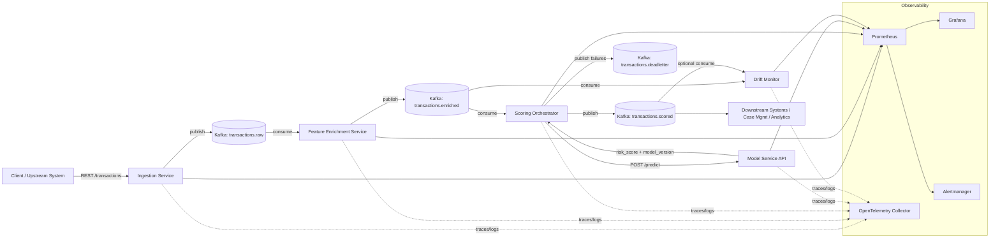

# Real-Time Transaction Scoring Pipeline: High-Level Architecture

## 1. Goal and Scope

Build a cloud-native, event-driven platform that ingests transaction events in real time, enriches features, scores risk through a model-serving API, and continuously monitors data drift and system health.

Key goals:
- Low-latency scoring for incoming transactions.
- Clear microservice boundaries for independent scaling and deployment.
- Reliable asynchronous processing using Kafka.
- Operational visibility with metrics, traces, logs, and drift alerts.
- Kubernetes-native deployment for portability and resilience.

## 2. Core Architecture

The pipeline is implemented as loosely coupled microservices communicating through Kafka topics.

### System Diagram (Mermaid)

### Services

1. Ingestion Service (Python FastAPI or Go Fiber)
- Accepts transaction events over REST.
- Validates schema and required fields.
- Adds request metadata (ingestion timestamp, trace ID).
- Publishes valid events to Kafka `transactions.raw`.

2. Feature Enrichment Service (Python or Go)
- Consumes from `transactions.raw`.
- Adds derived features (device risk hints, velocity counters, geo traits).
- Publishes enriched events to `transactions.enriched`.

3. Model Service API (Python FastAPI or Go)
- Exposes `/predict` endpoint for synchronous risk scoring.
- Loads a versioned model artifact (for example scikit-learn or ONNX).
- Returns `risk_score`, `model_version`, and optional `reason_codes`.
- Exposes health and model metadata endpoints (`/healthz`, `/model-info`).

4. Scoring Orchestrator (Python or Go)
- Consumes from `transactions.enriched`.
- Calls the Model Service API for each event.
- Applies timeout/retry/circuit-breaker policy.
- Publishes scored output to `transactions.scored`.
- Publishes failed processing to `transactions.deadletter`.

5. Drift Monitor (Python preferred)
- Consumes from `transactions.enriched` and/or `transactions.scored`.
- Compares live feature distributions with baseline/training distributions.
- Calculates drift indicators (for example PSI, KL divergence, mean/variance shift).
- Emits Prometheus metrics and logs/alerts when thresholds are breached.

6. Monitoring Stack
- Prometheus scrapes service and Kafka metrics.
- Grafana dashboards for throughput, latency, errors, score distribution, and drift.
- Alertmanager routes operational and model-quality alerts.

## 3. Kafka Topic Design

- `transactions.raw`
	- Producer: Ingestion Service
	- Consumers: Enrichment Service

- `transactions.enriched`
	- Producer: Enrichment Service
	- Consumers: Scoring Orchestrator, Drift Monitor

- `transactions.scored`
	- Producer: Scoring Orchestrator
	- Consumers: downstream systems, analytics, optional case-management sink

- `transactions.deadletter`
	- Producer: Scoring Orchestrator and other services on non-recoverable errors
	- Consumers: operational triage tools/processes

Design notes:
- Use keyed messages (for example `customer_id` or `transaction_id`) for ordering consistency.
- Use Avro/JSON schema versioning and schema validation at service boundaries.
- Use consumer groups for horizontal scale.

## 4. End-to-End Flow

1. Client submits a transaction to Ingestion Service.
2. Ingestion validates and publishes event to `transactions.raw`.
3. Enrichment consumes raw event, derives features, publishes to `transactions.enriched`.
4. Scoring Orchestrator consumes enriched event and calls Model Service `/predict`.
5. Orchestrator publishes final score payload to `transactions.scored`.
6. Drift Monitor continuously computes drift from live traffic and exposes metrics.
7. Grafana/Alertmanager surfaces operational incidents and drift anomalies.

## 5. Kubernetes Deployment Model

Deploy all services as containers on Kubernetes (local kind/minikube or AKS).

### Workload Layout

- One Deployment per microservice:
	- `ingestion-service`
	- `enrichment-service`
	- `model-service`
	- `scoring-orchestrator`
	- `drift-monitor`

- Supporting components:
	- Kafka (or managed Kafka/Event Hub bridge)
	- Prometheus + Grafana + Alertmanager
	- Optional OpenTelemetry Collector

### Kubernetes Best Practices

- Horizontal Pod Autoscaler for ingestion, enrichment, and scoring services.
- Readiness/liveness probes for every service.
- ConfigMaps for non-secret configuration; Secrets for credentials/keys.
- Pod resource requests/limits to protect cluster stability.
- Rolling updates for zero-downtime deployments.
- NetworkPolicies to restrict service-to-service traffic.

## 6. Observability and SLOs

### Metrics

- Throughput: events/sec per topic and per service.
- Latency: p50/p95/p99 for ingestion, enrichment, model inference, end-to-end scoring.
- Reliability: error rate, retry rate, dead-letter volume, consumer lag.
- Model quality proxy: score distribution drift, confidence shifts.
- Data quality: schema validation failures, missing/invalid feature counts.

### Tracing and Logging

- Propagate trace IDs from ingestion through all services.
- Emit structured logs with correlation IDs and key business fields.
- Capture distributed traces for Kafka consume/process/publish and model API calls.

## 7. Reliability and Failure Handling

- At-least-once processing semantics with idempotent consumers where needed.
- Retry with exponential backoff for transient downstream failures.
- Circuit breaker around model API calls to prevent cascading failures.
- Dead-letter topic for poison messages and operational replay.
- Graceful degradation path: if model service is unavailable, route to fallback risk policy.

## 8. Security and Compliance

- TLS in transit for API and Kafka communication.
- Authentication/authorization between services (service accounts, IAM/RBAC).
- PII minimization and masking in logs/metrics.
- Signed and versioned container images; vulnerability scanning in CI.

## 9. Suggested Implementation Phases

1. Build baseline happy-path pipeline (ingest -> enrich -> score).
2. Add observability (metrics, logs, traces, dashboards).
3. Add drift monitor and alerting thresholds.
4. Harden reliability (DLQ, retries, idempotency, autoscaling).
5. Add CI/CD and production-ready security controls.

## 10. High-Level Outcome

This architecture demonstrates platform engineering for AI systems: event-driven microservices, real-time model integration, operational observability, and cloud-native deployment patterns aligned with modern AML/fraud platforms.
